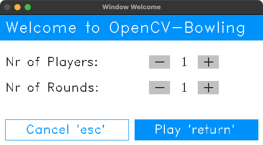
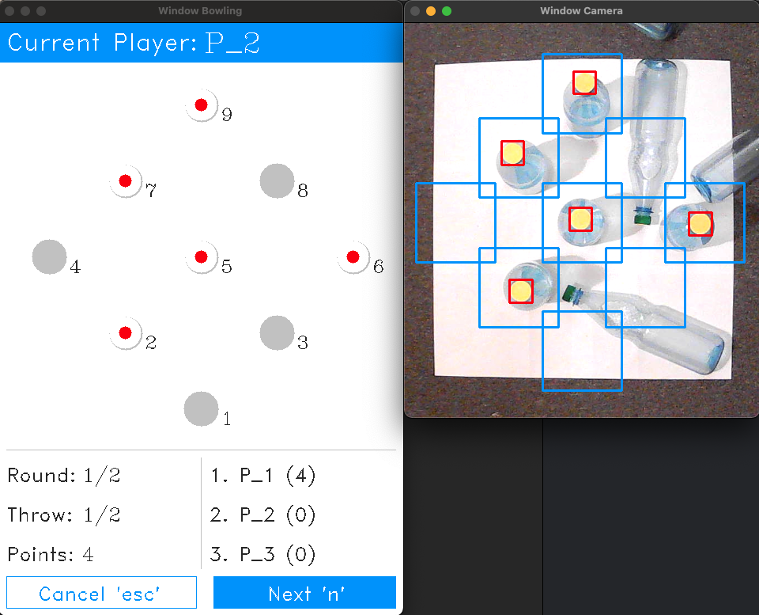
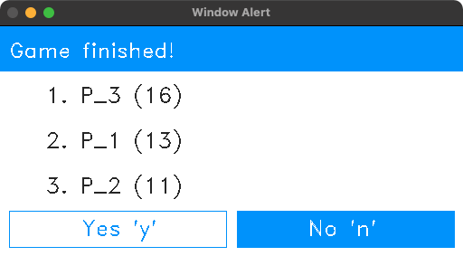
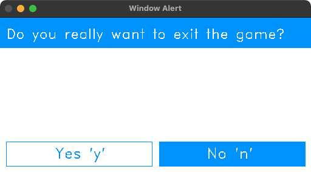

# OpenCV Bowling
Image Processing Laboratory WS21/22 

As part of the subject we build a Bowling game with OpenCV written in C++. The UI of the project is build with the OpenCV highgui functions.

### Welcome Window
|  | 
|:--:| 
| *Starting window of the application.* |

### Game Window
|  | 
|:--:| 
| *Main windows of the bowling game.* |

### Result Window
|  | 
|:--:| 
| *Award ceremony with the possibility to restart the game.* |

### Exit Window
|  | 
|:--:| 
| *End of the game.* |
